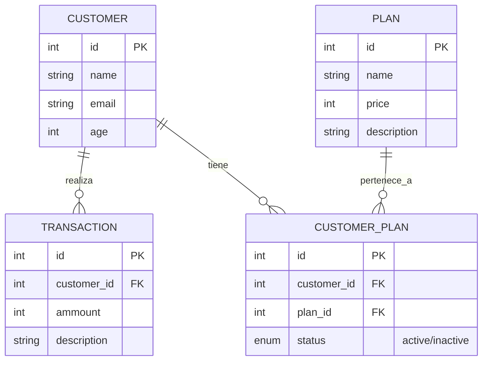

# Guía de Lógica y Estructura de Base de Datos

Esta guía detalla el diseño lógico y la estructura de datos del proyecto **AppTransactionFastAPI**. Está diseñada para ayudar a estudiantes y desarrolladores an comprender cómo interactúan las entidades principales del sistema.

## Propósito del Proyecto

El objetivo principal es gestionar un sistema de **Transacciones y Suscripciones**. En este modelo de negocio simplificado:
1.  Existen **Clientes** (Usuarios) que utilizan el servicio.
2.  El servicio ofrece diferentes **Planes** de suscripción.
3.  Un cliente puede estar suscrito a múltiples planes, y un plan puede tener muchos clientes.
4.  Los clientes generan **Transacciones** financieras, las cuales son registradas por el sistema.

## Entidades Principales (Tablas)

A continuación explicamos el propósito de cada tabla definida en `app/models.py`.

### 1. Customer (Cliente)
Representa a los usuarios del sistema. Contiene la información personal básica.
*   **Campos Clave**: `id`, `name`, `email`, `age`.
*   **Relaciones**:
    *   Tiene muchas `Transactions`.
    *   Tiene muchos `Plans` (a través de la tabla intermedia `CustomerPlan`).

### 2. Plan (Plan de Suscripción)
Representa los productos o niveles de servicio que ofrece la empresa.
*   **Campos Clave**: `id`, `name`, `price`, `description`.
*   **Relaciones**:
    *   Tiene muchos `Customers` (a través de la tabla intermedia `CustomerPlan`).

### 3. CustomerPlan (Tabla Intermedia)
Esta es la tabla que permite la relación **Muchos a Muchos (Many-to-Many)** entre Clientes y Planes.
*   **¿Por qué existe?**
    *   Un cliente puede contratar el "Plan A" y el "Plan B" al mismo tiempo.
    *   El "Plan A" puede ser contratado por "Juan", "Maria" y "Pedro".
*   **Lógica Adicional**:
    *   Incluye un campo `status` (`active` / `inactive`). Esto nos permite saber no solo *qué* plan tiene un cliente, sino si esa suscripción está **activa** o **cancelada** en este momento.

### 4. Transaction (Transacción)
Registra los movimientos financieros.
*   **Campos Clave**: `id`, `ammount`, `description`.
*   **Relaciones**:
    *   Pertenece a un solo `Customer` (Relación Uno a Muchos).

## Diagrama de Base de Datos (ERD)

El siguiente diagrama muestra cómo se relacionan estas tablas:

## Flujo Lógico de Ejemplo

1.  **Registro**: Se crea un nuevo `Customer` (ej. "Ana").
2.  **Suscripción**: Ana decide comprar el `Plan` "Premium".
    *   El sistema crea un registro en `CustomerPlan` vinculando el ID de Ana con el ID del Plan Premium.
    *   El estado (`status`) se establece en `active`.
3.  **Uso**: Ana realiza un pago.
    *   Se crea una `Transaction` vinculada al ID de Ana por el monto pagado.
4.  **Baja**: Ana decide cancelar su suscripción.
    *   No borramos el registro de `CustomerPlan`. En su lugar, actualizamos el `status` a `inactive`. Esto mantiene el historial de que Ana *tuvo* ese plan.
